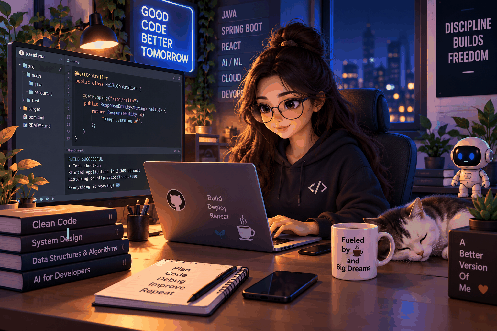

<!-- ========================================================= -->
<!--                    MK KARISHMA README                     -->
<!-- ========================================================= -->

<!-- ====================== HERO HEADER ====================== -->

<div align="center">


<br>


<br>


</div>

<br>

<!-- ===================== HERO SECTION ====================== -->

<table>
<tr>

<td width="55%" valign="top">

## 👋 About Me

I'm on a continuous journey to become a **production-ready Java Full Stack + AI Engineer**, building strong foundations in Computer Science and progressing toward scalable, secure, distributed, and AI-powered systems.

<br>

### 🧠 Engineering Philosophy

<div align="center">


</div>

<br>

> **Build systems that are reliable, scalable, secure and meaningful.**

</td>

<td width="45%" align="center" valign="middle">



</td>

</tr>
</table>

<br>

<!-- ====================== DIVIDER ========================== -->

<div align="center">


</div>

<br>

<!-- =================== TECHNOLOGY STACK ==================== -->

<div align="center">

## ⚙️ TECHNOLOGY STACK


</div>

<br>

### ☕ Languages

<p align="center">


</p>

### 🎨 Frontend

<p align="center">


</p>

### ⚡ Backend & APIs

<p align="center">


</p>

### 🗄️ Databases

<p align="center">


</p>

### ☁️ DevOps & Cloud

<p align="center">


</p>

<br>

<!-- ===================== AI ENGINEERING ==================== -->

<div align="center">


<br>


</div>

<br>

<table>
<tr>

<td width="50%" valign="top">

### 🤖 AI Engineering Focus

- Generative AI
- LLMs
- Prompt Engineering
- RAG
- Vector Databases
- Embeddings
- AI Agents
- Tool Calling
- AI Application Architecture

</td>

<td width="50%" valign="top">

### 🧩 AI System Concepts

- Context Engineering
- Retrieval Pipelines
- Semantic Search
- Knowledge Bases
- Agentic Workflows
- Function Calling
- AI + REST APIs
- AI + Microservices
- Production AI Systems

</td>

</tr>
</table>

<br>

<!-- ==================== WHAT I'M BUILDING ================== -->

<div align="center">

## 🚀 WHAT I'M BUILDING


</div>

<br>

<table>
<tr>

<td width="50%" valign="top">

### 💻 Full Stack Engineering

- Java Full Stack Applications
- Spring Boot REST APIs
- Secure Authentication & Authorization
- Microservices
- Event-Driven Systems
- Kafka Applications
- RabbitMQ Applications
- Redis-Based Caching
- React Applications
- Cloud-Ready Applications

</td>

<td width="50%" valign="top">

### 🤖 AI Engineering

- AI-Powered Applications
- RAG-Based Systems
- AI Agent Applications
- LLM Applications
- Vector Search Systems
- AI APIs
- AI + Microservices
- Production-Level AI Systems
- Distributed AI Applications

</td>

</tr>
</table>

<br>

<!-- ==================== FEATURED PROJECTS ================== -->

<div align="center">


</div>

<br>

<table>
<tr>

<td width="50%" valign="top">

### 💳 FinTech Digital Payment System

**Credit Card on UPI**

Production-oriented payment processing architecture using:

- Java
- Spring Boot
- Microservices
- REST APIs
- Spring Security
- JWT
- Apache Kafka
- RabbitMQ
- Redis
- PostgreSQL

**Focus:** Secure transactions, asynchronous processing, reconciliation, scalability and distributed architecture.

</td>

<td width="50%" valign="top">

### 🤖 AI-Powered Application

**Intelligent RAG Platform**

Building an AI application around:

- LLMs
- RAG
- Embeddings
- Vector Databases
- Semantic Search
- AI Agents
- Tool Calling
- REST APIs

**Focus:** Production-ready AI workflows and intelligent knowledge retrieval.

</td>

</tr>
</table>

<br>

<!-- ===================== GITHUB ANALYTICS ================== -->

<div align="center">


<br><br>


<br><br>


</div>

<br>

<!-- ================= CONTRIBUTION GRAPH =================== -->

<div align="center">

## 📈 CONTRIBUTION ACTIVITY

<br>


</div>

<br>

<!-- ====================== TROPHIES ========================= -->

<div align="center">

## 🏆 GITHUB ACHIEVEMENTS

<br>


</div>

<br>

<!-- ================= CURRENTLY LEARNING ==================== -->

<div align="center">


</div>

<br>

<table>
<tr>

<td width="33%" align="center">

### ☕ Java

Java  
JVM  
Collections  
Concurrency  
I/O & NIO  
Advanced Java

</td>

<td width="33%" align="center">

### 🌱 Spring

Spring Boot  
REST  
Security  
JPA / Hibernate  
Microservices  
Distributed Systems

</td>

<td width="33%" align="center">

### 🤖 AI

LLMs  
RAG  
Embeddings  
Vector DBs  
AI Agents  
AI Architecture

</td>

</tr>
</table>

<br>

<!-- ===================== ENGINEERING ROADMAP ============== -->

<div align="center">

## 🧭 ENGINEERING JOURNEY

</div>

```text
                    ENGINEERING JOURNEY

        ┌───────────────────────────────────┐
        │        COMPUTER SCIENCE           │
        └─────────────────┬─────────────────┘
                          ↓
        ┌───────────────────────────────────┐
        │             JAVA                  │
        └─────────────────┬─────────────────┘
                          ↓
        ┌───────────────────────────────────┐
        │        SPRING / SPRING BOOT       │
        └─────────────────┬─────────────────┘
                          ↓
        ┌───────────────────────────────────┐
        │        REST / SECURITY / JPA      │
        └─────────────────┬─────────────────┘
                          ↓
        ┌───────────────────────────────────┐
        │          MICROSERVICES             │
        └─────────────────┬─────────────────┘
                          ↓
        ┌───────────────────────────────────┐
        │      KAFKA / RABBITMQ / REDIS     │
        └─────────────────┬─────────────────┘
                          ↓
        ┌───────────────────────────────────┐
        │        REACT / FULL STACK         │
        └─────────────────┬─────────────────┘
                          ↓
        ┌───────────────────────────────────┐
        │       CLOUD / DEVOPS / AWS       │
        └─────────────────┬─────────────────┘
                          ↓
        ┌───────────────────────────────────┐
        │        GENERATIVE AI             │
        └─────────────────┬─────────────────┘
                          ↓
        ┌───────────────────────────────────┐
        │        RAG / AI AGENTS            │
        └─────────────────┬─────────────────┘
                          ↓
        ┌───────────────────────────────────┐
        │   PRODUCTION AI + DISTRIBUTED    │
        │             SYSTEMS               │
        └───────────────────────────────────┘
